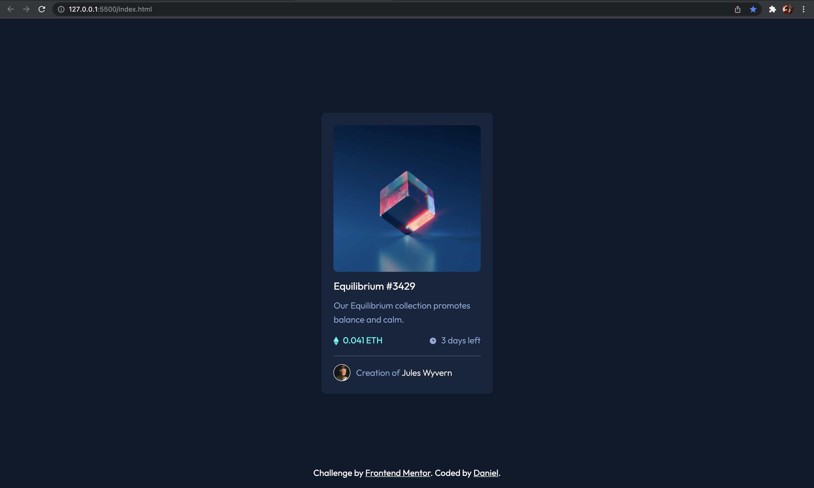

# Frontend Mentor - NFT preview card component solution

This is a solution to the [NFT preview card component challenge on Frontend Mentor](https://www.frontendmentor.io/challenges/nft-preview-card-component-SbdUL_w0U). Frontend Mentor challenges help you improve your coding skills by building realistic projects. 

## Table of contents

- [Overview](#overview)
  - [The challenge](#the-challenge)
  - [Screenshot](#screenshot)
  - [Links](#links)
- [My process](#my-process)
  - [Built with](#built-with)
  - [Continued development](#continued-development)
- [Author](#author)

**Note: Delete this note and update the table of contents based on what sections you keep.**

## Overview

### The challenge

Users should be able to:

- View the optimal layout depending on their device's screen size
- See hover states for interactive elements

### Screenshot

### Links

- Solution URL: [Add solution URL here](https://your-solution-url.com)
- Live Site URL: [Add live site URLgit here](https://your-live-site-url.com)

## My process
I first had to set up the HTML with divs so I can easily section each of the info in the card. Then, I used flexbox for the card so I can add gapping and equal spacing. For the currency and 'days left' part, I used a flexbox so I can add a space-between to make them separate. Next step was to add the hover effect. Finally, I had to add mobile responsiveness to make it, well, responsive in mobile!
### Built with

- Semantic HTML5 markup
- CSS custom properties
- Flexbox
- CSS Grid
- Mobile-first workflow
- Sass

### Continued development

I want to get more comfortable in writing cleaner code and having a good idea of what color should go with what.

## Author

- Frontend Mentor - [@danielbrah](https://www.frontendmentor.io/profile/danielbrah)
